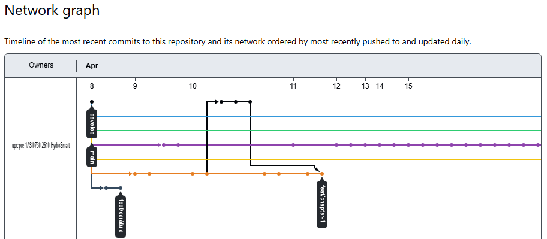
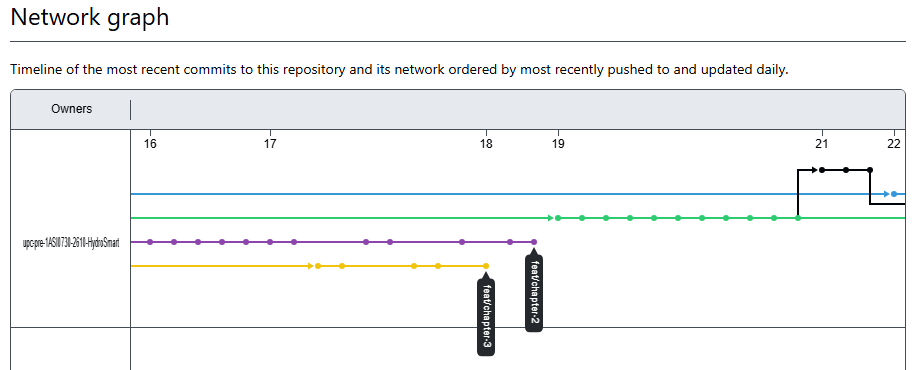
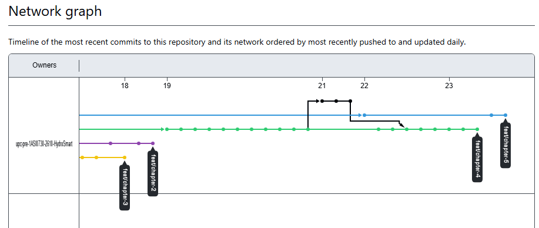
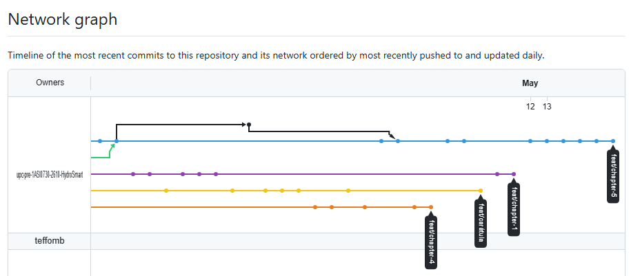
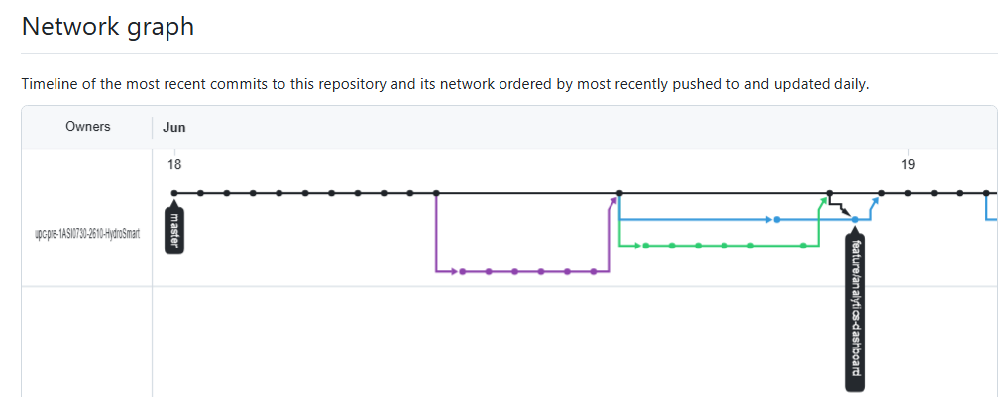
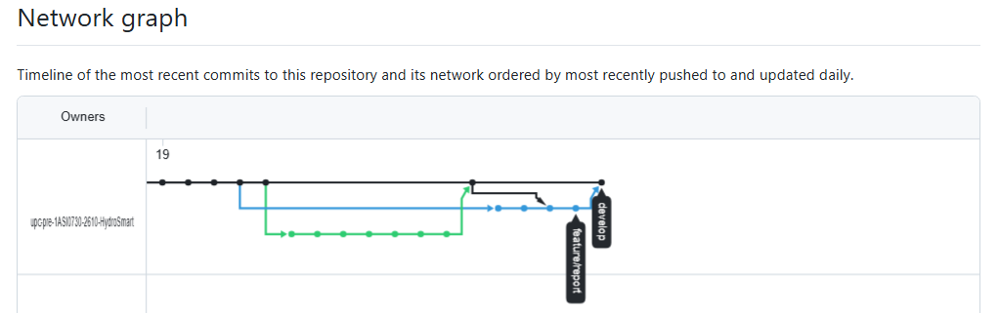

<h3>Universidad Peruana de Ciencias Aplicadas</h3>
<h4>Facultad de Ingeniería</h4>
<h4>Carrera de Ingeniería de Software</h4>
<h4>Periodo 202601</h4>
<h4>1ASI0730 Aplicaciones Web</h4>
<h4>NRC: 2610</h4>
<h4>Docente: Rafael Oswaldo Castro Veramendi</h4>
<h4>Informe del Trabajo Final</h4>
<h4>Startup: HydroSmart</h4>
<h4>Producto: AquaPulse</h4>

 

<h2 style="text-align: center;">Team members:</h2>

<table style="margin: 0 auto; text-align: center;">
  <thead>
    <tr>
      <th>Código</th>
      <th>Nombre</th>
    </tr>
  </thead>
  <tbody>
    <tr>
      <td>U20211G499</td>
      <td>Moscoso Bejar Angelo Stephano</td>
    </tr>
    <tr>
      <td>U20221C726</td>
      <td>Keyner Ivan Hancco Poma</td>
    </tr>
    <tr>
      <td>U202419592</td>
      <td>Gabriela Luciana Tirado Carrera</td>
    </tr>
    <tr>
      <td>U202210513</td>
      <td>Yeira Shari Huaman Olivos</td>
    </tr>
    <tr>
      <td>U202318951</td>
      <td>Diego Ismael Guevara Serrano</td>
    </tr>
  </tbody>
</table>

 
<h4 style="text-align: center;">Abril 2026</h4>

## Registro de Versiones del Informe

| Version | Fecha | Autor | Descripcion de Modificacion |
|--------|------|------|-----------------------------|
| 0.1 | 09/04/2026 | Equipo | Se actualizó el README incorporando el perfil de la solución, antecedentes, problemática, misión, visión y perfiles del equipo. |
| 0.2 | 10/04/2026 | Equipo | Se desarrolló el Capítulo 1, incluyendo Lean UX Problem Statements, Assumptions, Hypothesis Statements, segmentos objetivos y Lean UX Canvas. |
| 0.3 | 11/04/2026 | Equipo | Se añadieron business assumptions y se consolidó la documentación Lean UX. |
| 0.4 | 12/04/2026 | YeiShari | Se diseñaron y documentaron las entrevistas. |
| 0.5 | 13/04/2026 | Gaby0443 | Se añadieron entrevistas del segundo segmento objetivo. |
| 0.6 | 14/04/2026 | YeiShari | Se incorporaron y corrigieron entrevistas. |
| 0.7 | 15/04/2026 | YeiShari | Se añadieron user personas, needfinding y evidencias. |
| 0.8 | 17/04/2026 | Equipo | Se desarrolló el análisis de entrevistas, Ubiquitous Language y EventStorming. |
| 0.9 | 18/04/2026 | teffomb | Se añadieron resúmenes de entrevistas y User Journey Mapping. |
| 1.0 | 24/04/2026 | teffomb / Equipo | Se incorporaron Empathy Mapping e imágenes. |
| 1.1 | 17/04/2026 | digeto | Se inició el Capítulo 3 con la definición de Epics, User Stories y Technical Stories. |
| 1.2 | 17/04/2026 | YeiShari | Se desarrolló el Impact Mapping. |
| 1.3 | 18/04/2026 | 1Kanan2 | Se agregó el Product Backlog completo. |
| 1.4 | 19/04/2026 | digeto | Se inició el Capítulo 4 con Navigation Systems, Searching Systems y diseño de Landing Page (wireframes y mockups). |
| 1.5 | 19/04/2026 | YeiShari | Se desarrollaron sistemas de organización, arquitectura de información y guías de estilo. |
| 1.6 | 19/04/2026 | Gaby0443 | Se añadieron EventStorming de diseño y diagramas C4. |
| 1.7 | 21/04/2026 | teffomb | Se desarrolló el diseño orientado a objetos y base de datos. |
| 1.8 | 22/04/2026 | digeto / Equipo | Se desarrolló el diseño UX/UI de la aplicación web, incluyendo estructura general. |
| 1.9 | 23/04/2026 | 1Kanan2 / Gaby0443 | Se añadieron wireflows, mockups y actualización del prototipo. |
| 2.0 | 22/04/2026 | Gaby0443 | Se inició el Capítulo 5 con Sprint Planning y evidencias. |
| 2.1 | 23/04/2026 | YeiShari | Se documentó la configuración del entorno y gestión del código. |
| 2.2 | 23/04/2026 | 1Kanan2 | Se añadieron conclusiones, recomendaciones y bibliografía. |
| 2.3 | 24/04/2026 | teffomb | Se agregaron evidencias de ejecución y despliegue. |
| 2.4 | 24/04/2026 | digeto | Se documentó la implementación de la Landing Page, servicios y aplicaciones. |
| 2.5 | 24/04/2026 | Equipo | Se añadieron insights del equipo y cierre del proyecto. |
| 2.6 | 13/05/2026 | YeiShari | Se añadieron líderes de aspectos y colaboradores del Sprint 2. |
| 2.7 | 13/05/2026 | YeiShari | Se incorporaron evidencias de desarrollo para el Sprint 2 Review. |
| 2.8 | 13/05/2026 | YeiShari | Se agregaron evidencias de ejecución para el Sprint 2 Review. |
| 2.9 | 13/05/2026 | YeiShari | Se añadió documentación de servicios como evidencia para el Sprint Review. |
| 3.0 | 13/05/2026 | YeiShari | Se incorporó el Sprint Backlog 2. |
| 3.1 | 13/05/2026 | Gaby0443 | Se añadieron evidencias visuales del Sprint 2 (imágenes). |
| 3.2 | 13/05/2026 | Gaby0443 | Se agregaron imágenes de apoyo para commits. |
| 3.3 | 13/05/2026 | Gaby0443 | Se actualizaron extensiones y tamaños de imágenes. |
| 3.4 | 13/05/2026 | Gaby0443 | Se refactorizaron etiquetas de imágenes para mayor consistencia. |
| 3.5 | 13/05/2026 | Gaby0443 | Se añadieron evidencias de contribuciones del frontend. |
| 3.6 | 13/05/2026 | Gaby0443 | Se corrigieron nombres de archivos de imágenes. |
| 3.7 | 13/05/2026 | Gaby0443 | Se actualizaron imágenes del proyecto. |
| 3.8 | 13/05/2026 | Digetto | Se actualizó el archivo README.md. |
| 3.9 | 13/05/2026 | Gaby0443 | Se añadió evidencia de contribuciones en la documentación del Sprint 2. |
| 4.0 | 13/05/2026 | Gaby0443 | Se incorporaron evidencias de commits del documento. |
| 4.1 | 13/05/2026 | Gaby0443 | Se actualizaron detalles de despliegue y colaboración del proyecto. |
| 4.2 | 13/06/2026 | YeiShari | Se documentó el Sprint Planning 3, incluyendo objetivos, participantes y velocidad del sprint. |
| 4.3 | 14/06/2026 | Equipo | Se consolidó la matriz LACX para la distribución de responsabilidades del Sprint 3. |
| 4.4 | 15/06/2026 | Digetto | Se implementaron y documentaron los endpoints del módulo de Reports Management (historial y comparativos). |
| 4.5 | 15/06/2026 | 1Kanan2 | Se desarrolló la lógica del Dashboard Management y la proyección de consumo mensual. |
| 4.6 | 15/06/2026 | Gaby0443 | Se implementó la gestión completa de dispositivos (CRUD) y su persistencia en MySQL. |
| 4.7 | 16/06/2026 | Dang | Se desarrolló el módulo de Settings, incluyendo configuración de notificaciones y preferencias de usuario. |
| 4.8 | 16/06/2026 | Equipo | Se integraron commits del repositorio como evidencia de desarrollo del Sprint 3. |
| 4.9 | 17/06/2026 | Equipo | Se documentaron evidencias de servicios y validación de endpoints mediante Swagger. |
| 5.0 | 17/06/2026 | Equipo | Se consolidó el Sprint Backlog 3 con User Stories, tareas y estados de avance. |
| 5.1 | 18/06/2026 | Equipo | Se elaboró la documentación de evidencias de ejecución del Sprint 3 (módulos integrados del backend). |
| 5.2 | 18/06/2026 | Equipo | Se integró el reporte AV2 completo incluyendo arquitectura backend, endpoints y colaboración del equipo. |
| 5.3 | 18/06/2026 | Equipo | Se añadieron las entrevistas de validación para evaluación de la plataforma AquaPulse. |

## Project Report Collaboration Insights

**Link de la organización:**
https://github.com/upc-pre-1ASI0730-2610-HydroSmart

**Link del Repositorio del Informe:** https://github.com/upc-pre-1ASI0730-2610-HydroSmart/Report.git

### Reporte de Colaboración para la Entrega del AV1

**AV1 - Desarrollo del reporte y diseño de la landing page:**

En esta primera evaluación del proyecto HydroSmart, el trabajo se centró en establecer una base sólida tanto a nivel conceptual como de diseño, definiendo la propuesta de la startup y su aplicación AquaPulse. Se priorizó la identificación de las necesidades de los usuarios, específicamente propietarios de viviendas con áreas verdes y estudiantes que alquilan, quienes presentan dificultades para controlar su consumo de agua. A través de técnicas de análisis y levantamiento de información, se logró comprender la problemática y orientar el desarrollo de una solución alineada a estos contextos.

A partir de este análisis, se desarrollaron componentes clave del proyecto como la definición del problema, la propuesta de valor y el enfoque Lean UX, que permitió estructurar las ideas de manera centrada en el usuario. Asimismo, se complementó con la elaboración de user personas y la identificación de sus principales comportamientos, objetivos y frustraciones, lo que facilitó una mejor comprensión del escenario de uso. Este proceso también permitió organizar la información necesaria para sustentar el diseño de la solución.

En la fase de diseño, se establecieron lineamientos visuales para garantizar coherencia en la interfaz, junto con la definición de la arquitectura de información, incluyendo sistemas de organización, etiquetado y navegación. Se desarrollaron wireframes, mockups y flujos de usuario que representan las principales interacciones dentro de la plataforma. Como resultado tangible, se implementó la landing page del proyecto, evidenciando el avance alcanzado en esta etapa y dejando una base estructurada para las siguientes fases de desarrollo.

## Contributors

  

  

  

**Guevara Serrano, Diego Ismael**  
- **Lean UX y Definición Inicial.** Contribuyó en el desarrollo del proceso Lean UX, incluyendo la formulación de supuestos e hipótesis, estableciendo una base clara para el enfoque del proyecto.  
- **Investigación de Usuarios.** Participó en el registro de entrevistas y en la construcción de user stories, permitiendo comprender mejor las necesidades del usuario.  
- **Arquitectura de Información.** Aportó en la definición de sistemas de búsqueda y navegación, mejorando la estructura de la información.  
- **Diseño de Landing Page.** Desarrolló wireframes, mockups y el diseño visual de la landing page.  
- **Configuración Técnica.** Documentó guías de estilo de código y configuraciones iniciales para el despliegue del sistema.

**Hancco Poma, Keyner Ivan**  
- **Análisis Competitivo.** Realizó el análisis de competidores y propuso estrategias para fortalecer la propuesta de valor.  
- **Gestión del Producto.** Participó en la elaboración del product backlog y en la definición de funcionalidades.  
- **Diseño de Aplicación Web.** Desarrolló wireframes, wireflows, mockups y diagramas de flujo de usuario.  
- **Landing Page.** Contribuyó en la sección de FAQ, footer y estructura general.  
- **Documentación.** Elaboró conclusiones, recomendaciones y bibliografía del proyecto.

**Huaman Olivos, Yeira Shari**  
- **Lean UX Canvas y Segmentación.** Elaboró el Lean UX Canvas y definió los segmentos objetivos del proyecto.  
- **Investigación y Análisis.** Diseñó entrevistas, analizó resultados y desarrolló user personas y user task matrix.  
- **Impact Mapping.** Construyó el mapeo de impactos alineando objetivos del negocio con funcionalidades.  
- **Guías de Estilo y Arquitectura.** Definió lineamientos visuales, arquitectura de información, sistemas de organización y etiquetado.  
- **Diseño de Landing Page.** Participó en el diseño UI, wireframes y mockups.  
- **Configuración de Software.** Documentó aspectos de gestión, entorno y administración del código.

**Moscoso Bejar, Angelo Stephano**  
- **Definición del Problema.** Desarrolló la descripción de la startup, antecedentes y problemática.  
- **Análisis del Usuario.** Elaboró user journey mapping y empathy mapping para entender la experiencia del usuario.  
- **Diseño de Software.** Trabajó en diseño orientado a objetos, diagramas de clases y base de datos.  
- **Arquitectura Técnica.** Desarrolló diagramas y estructura de base de datos.  
- **Evidencias Técnicas.** Documentó evidencias de ejecución, servicios y despliegue del sistema.

**Tirado Carrera, Gabriela Luciana**  
- **Análisis de Competencia.** Identificó competidores y apoyó en el registro de entrevistas.  
- **Modelado del Dominio.** Participó en Big Picture Event Storming y lenguaje ubicuo.  
- **Arquitectura de Software.** Desarrolló diagramas C4: contexto, contenedores y componentes.  
- **Prototipado Web.** Contribuyó en el desarrollo de prototipos de la aplicación.  
- **Gestión Ágil.** Participó en sprint planning, backlog y organización del equipo.  
- **Evidencias de Desarrollo.** Documentó avances y evidencias para la revisión del sprint.

**Contribuciones Grupales**  
- **Investigación de Usuarios.** Desarrollo conjunto de entrevistas y análisis de necesidades.  
- **Diseño UX/UI.** Creación colaborativa de la landing page, incluyendo wireframes y mockups.  
- **Arquitectura de Información.** Definición de sistemas de organización, navegación y etiquetado.  
- **Modelado del Sistema.** Elaboración de diagramas y estructura inicial del sistema.  
- **Planificación del Proyecto.** Construcción del backlog, planificación del sprint y coordinación del equipo.

### Reporte de Colaboración para la Entrega del TB1

**TB1 - Desarrollo del reporte y diseño de la solución AquaPulse:**

En esta primera entrega del proyecto AquaPulse, el trabajo se centró en establecer una base sólida tanto a nivel conceptual como de diseño, definiendo la propuesta de la startup y su aplicación orientada a la optimización del consumo de agua en entornos domésticos. Se priorizó la identificación de las necesidades de los usuarios, especialmente aquellos que buscan monitorear y comprender su consumo de agua, quienes presentan dificultades para interpretar su gasto y tomar decisiones informadas. A través de técnicas de análisis y levantamiento de información, se logró comprender la problemática y orientar el desarrollo de una solución alineada a estos contextos.

A partir de este análisis, se desarrollaron componentes clave del proyecto como la definición del problema, la propuesta de valor y el enfoque Lean UX, que permitió estructurar las ideas de manera centrada en el usuario. Asimismo, se complementó con la elaboración de user personas y la identificación de sus principales comportamientos, objetivos y frustraciones, lo que facilitó una mejor comprensión del escenario de uso. Este proceso también permitió organizar la información necesaria para sustentar el diseño de la solución.

En la fase de diseño, se establecieron lineamientos visuales para garantizar coherencia en la interfaz, junto con la definición de la arquitectura de información, incluyendo sistemas de organización, etiquetado y navegación. Se desarrollaron wireframes, mockups y flujos de usuario que representan las principales interacciones dentro de la plataforma, como la visualización del consumo, el análisis de datos y la gestión de alertas. Como resultado tangible, se implementaron prototipos de la aplicación web, evidenciando el avance alcanzado en esta etapa y dejando una base estructurada para las siguientes fases de desarrollo.

## Contributors

  

  

  

**Guevara Serrano, Diego Ismael**
- **Módulo de Reportes.** Participó en la definición y diseño de la visualización del historial y análisis del consumo de agua.
- **Investigación de Usuarios.** Apoyó en la construcción de user stories relacionadas al análisis de consumo.
- **Diseño de la Aplicación.** Desarrolló wireframes y mockups enfocados en reportes y gráficos.
- **Documentación.** Contribuyó en la elaboración del reporte del proyecto

**Hancco Poma, Keyner Ivan**
- **Módulo Dashboard - Analytics.** Lideró el diseño del dashboard principal para la visualización clara del consumo de agua.
- **Gestión del Producto.** Participó en la elaboración del product backlog y definición de funcionalidades analíticas.
- **Diseño de Aplicación Web.** Desarrolló wireframes, wireflows y mockups del dashboard.
- **Documentación.** Apoyó en conclusiones y desarrollo del reporte.

**Huaman Olivos, Yeira Shari**
- **Módulo Profile y Notifications.** Participó en la definición de funcionalidades relacionadas al perfil de usuario y sistema de notificaciones.
- **Lean UX Canvas y Segmentación.** Elaboró el Lean UX Canvas y definió segmentos de usuarios.
- **Investigación y Análisis.** Diseñó entrevistas y desarrolló user personas.
- **Diseño UX/UI.** Contribuyó en wireframes y mockups enfocados en experiencia del usuario.

**Moscoso Bejar, Angelo Stephano**
- **Módulo Settings.** Participó en la definición de funcionalidades de configuración y personalización de la aplicación.
- **Definición del Problema.** Desarrolló la problemática del proyecto y su contexto.
- **Análisis del Usuario.** Elaboró user journey mapping y empathy mapping.
- **Arquitectura Técnica.** Apoyó en la estructura inicial del sistema.

**Tirado Carrera, Gabriela Luciana**
- **Módulo Devices.** Participó en la conceptualización de la gestión de dispositivos dentro de la plataforma.
- **Análisis de Competencia.** Identificó soluciones similares en el mercado.
- **Modelado del Dominio.** Apoyó en la definición del sistema y sus componentes.
- **Prototipado Web.** Contribuyó en el desarrollo de interfaces.

**Contribuciones Grupales**
- **Investigación de Usuarios.** Desarrollo conjunto del análisis de necesidades relacionadas al consumo de agua.
- **Diseño UX/UI.** Creación colaborativa de wireframes, mockups y flujos de usuario.
- **Arquitectura de Información.** Definición de sistemas de organización, navegación y etiquetado.
- **Planificación del Proyecto.** Construcción del backlog y organización del trabajo del equipo.

### Reporte de Colaboración para la Entrega del AV2

**AV2 - Desarrollo del Backend de la API REST e Integración del Sistema:**

En esta segunda evaluación del proyecto HydroSmart, el trabajo se trasladó de la conceptualización inicial y el diseño estático hacia la construcción y consolidación de una infraestructura técnica real. Durante el Sprint 3, el equipo concentró sus esfuerzos en el desarrollo del backend de la plataforma utilizando una arquitectura escalable en .NET con persistencia en una base de datos MySQL, logrando migrar con éxito de simulaciones estáticas a un flujo real de almacenamiento y consulta de datos.

El enfoque primordial de este periodo se centró en dotar a HydroSmart de la lógica de negocio y los endpoints necesarios para que los usuarios finales puedan monitorear, gestionar y comprender su consumo de agua de manera fluida. Se implementaron con éxito las capas de persistencia, servicios (Commands/Queries) y controladores REST, los cuales fueron debidamente documentados y probados mediante Swagger. Asimismo, se preparó la validación cualitativa del sistema mediante el diseño de entrevistas enfocadas en medir el impacto de la solución y la claridad del dashboard tanto en propietarios de viviendas como en estudiantes que alquilan.

## Contributors

  

  

**Guevara Serrano, Diego Ismael**
- **Liderazgo de Aspecto (Reports Management).** Encargado principal del modelado y la extracción de datos históricos de consumo de agua dentro del sistema.
- **Desarrollo de Endpoints de Análisis.** Implementó por completo la US06 (Historial de consumo) y la US16 (Comparativo de consumo semanal), codificando la lógica de filtrado por rangos de fechas para transferir colecciones estructuradas de datos al frontend.
- **Documentación de Controladores.** Consolidó y estructuró los controladores de reportería e historial para su correcta visualización y prueba de carga de datos en Swagger UI.

**Hancco Poma, Keyner Ivan**
- **Liderazgo de Aspecto (Dashboard Management).** Responsable de la lógica central que alimenta la interfaz analítica del usuario final.
- **Desarrollo de Lógica Analítica.** Diseñó las soluciones para la US05 (Claridad del consumo en dashboard) y la US07 (Proyección de gasto mensual), elaborando los algoritmos matemáticos en el backend para predecir el gasto financiero del mes corriente según el promedio de consumo diario detectado por los sensores.
- **Infraestructura de Datos.** Desarrolló los endpoints de analítica bajo la ruta /api/v1/analytics/dashboard/{userId} para centralizar la entrega de KPIs en una sola petición web.
- **Documentación.** Apoyó en conclusiones y desarrollo del reporte.

**Huaman Olivos, Yeira Shari**
- **Liderazgo de Aspecto (Notifications, Profile & IAM).** Dirigió el diseño e implementación del backend de perfiles de usuario, el control de acceso y el módulo de alertas críticas de consumo.
- **Desarrollo de Endpoints y Lógica.** Desarrolló e implementó las User Stories de alertas preventivas (US08: Alerta de consumo inusual y US09: Alerta de posible fuga), programando la lógica para identificar patrones continuos o picos anómalos de flujo.
- **Persistencia y Servicios.** Diseñó los controladores de /api/v1/profiles (operaciones CRUD para perfiles de usuario), inyectando los servicios de comandos y consultas correspondientes en la arquitectura.
- **Planificación Ágil.** Actuó como preparadora del Sprint Planning 3 en la sesión virtual vía Discord, consolidando los objetivos y las estimaciones de velocidad del equipo.

**Moscoso Bejar, Angelo Stephano**
- **Liderazgo de Aspecto (Settings)** Responsable de estructurar la persistencia de las preferencias del sistema.
- **Desarrollo de Configuraciones.** Implementó la US10 (Configuración de notificaciones), permitiendo a los usuarios modificar y guardar sus límites personalizados de alerta de agua a través del endpoint /api/settings.
- **Integración y Arquitectura del Repositorio.** Llevó a cabo la corrección y refactorización de modelos en la base de datos MySQL, asegurando las extensiones del ModelBuilder en el contexto de persistencia de Entity Framework.

**Tirado Carrera, Gabriela Luciana**
- **Liderazgo de Aspecto (eDevices Management).** Lideró la construcción del módulo físico del sistema (gestión de hardware simulado/dispositivos de medición).
- **Desarrollo CRUD de Dispositivos.** Diseñó e implementó la totalidad de la US17 (Gestión de dispositivos), habilitando el registro, listado, actualización y eliminación física de los medidores inteligentes de agua a través de los endpoints de la ruta /devices.
- **Configuración de Persistencia.** Mapeó la configuración de persistencia relacional en MySQL para la entidad Device, asegurando la integridad referencial con los usuarios del sistema.

**Contribuciones Grupales**
- **Construcción del Backend Común.** Integración colaborativa del repositorio HydroSmart-Backend, adoptando un flujo de trabajo ágil basado en ramas de Git según el aspecto asignado (feat/profile, feat/notifications, feat/devices, feat/settings, feat/analytics, feat/IAM).
- **Diseño del Instrumento de Validación Cualitativa.** Planificación conjunta de las guías de entrevistas de validación para los dos segmentos clave (propietarios de viviendas y estudiantes), enfocadas en recopilar feedback directo sobre el valor del monitoreo en tiempo real, las notificaciones de fuga y el uso práctico del software.
- **Estandarización y Documentación de la API.** Pruebas y validaciones cruzadas de los contratos de endpoints a través de Swagger, garantizando respuestas y códigos de estado HTTP uniformes para asegurar una comunicación limpia con el frontend en el siguiente Sprint.

# Contenido

- [Student Outcome](#student-outcome)
- [Capítulo I: Introducción](#capitulo-i-introduccion)
    - [1.1. Startup Profile](#11-startup-profile)
        - [1.1.1. Descripción de la Startup](#111-descripción-de-la-startup)
        - [1.1.2. Perfiles de integrantes del equipo](#112-perfiles-de-integrantes-del-equipo)
    - [1.2. Solution Profile](#12-solution-profile)
        - [1.2.1. Antecedentes y problemática](#121-antecedentes-y-problemática)
        - [1.2.2. Lean UX Process](#122-lean-ux-process)
            - [1.2.2.1. Lean UX Problem Statements](#1221-lean-ux-problem-statements)
            - [1.2.2.2. Lean UX Assumptions](#1222-lean-ux-assumptions)
            - [1.2.2.3. Lean UX Hypothesis Statements](#1223-lean-ux-hypothesis-statements)
            - [1.2.2.4. Lean UX Canvas](#1224-lean-ux-canvas)
    - [1.3. Segmentos Objetivo](#13-segmentos-objetivo)

- [Capítulo II: Requirements Elicitation & Analysis](#capitulo-ii-requirements-elicitation--analysis)
    - [2.1. Competidores](#21-competidores)
        - [2.1.1. Análisis competitivo](#211-análisis-competitivo)
        - [2.1.2. Estrategias y tácticas frente a competidores](#212-estrategias-y-tácticas-frente-a-competidores)
    - [2.2. Entrevistas](#22-entrevistas)
        - [2.2.1. Diseño de entrevistas](#221-diseño-de-entrevistas)
        - [2.2.2. Registro de entrevistas](#222-registro-de-entrevistas)
        - [2.2.3. Análisis de entrevistas](#223-análisis-de-entrevistas)
    - [2.3. Needfinding](#23-needfinding)
        - [2.3.1. User Personas](#231-user-personas)
        - [2.3.2. User Task Matrix](#232-user-task-matrix)
        - [2.3.3. User Journey Mapping](#233-user-journey-mapping)
        - [2.3.4. Empathy Mapping](#234-empathy-mapping)
    - [2.4. Big Picture EventStorming](#24-big-picture-eventstorming)
    - [2.5. Ubiquitous Language](#25-ubiquitous-language)

- [Capítulo III: Requirements Specification](#capitulo-iii-requirements-specification)
    - [3.1. User Stories](#31-user-stories)
    - [3.2. Impact Mapping](#32-impact-mapping)
    - [3.3. Product Backlog](#33-product-backlog)

- [Capítulo IV: Product Design](#capitulo-iv-product-design)
    - [4.1. Style Guidelines](#41-style-guidelines)
        - [4.1.1. General Style Guidelines](#411-general-style-guidelines)
        - [4.1.2. Web Style Guidelines](#412-web-style-guidelines)
    - [4.2. Information Architecture](#42-information-architecture)
        - [4.2.1. Organization Systems](#421-organization-systems)
        - [4.2.2. Labeling Systems](#422-labeling-systems)
        - [4.2.3. SEO Tags and Meta Tags](#423-seo-tags-and-meta-tags)
        - [4.2.4. Searching Systems](#424-searching-systems)
        - [4.2.5. Navigation Systems](#425-navigation-systems)
    - [4.3. Landing Page UI Design](#43-landing-page-ui-design)
        - [4.3.1. Landing Page Wireframe](#431-landing-page-wireframe)
        - [4.3.2. Landing Page Mock-up](#432-landing-page-mock-up)
    - [4.4. Web Applications UX/UI Design](#44-web-applications-uxui-design)
        - [4.4.1. Web Applications Wireframes](#441-web-applications-wireframes)
        - [4.4.2. Web Applications Wireflow Diagrams](#442-web-applications-wireflow-diagrams)
        - [4.4.3. Web Applications Mock-ups](#443-web-applications-mock-ups)
        - [4.4.4. Web Applications User Flow Diagrams](#444-web-applications-user-flow-diagrams)
    - [4.5. Web Applications Prototyping](#45-web-applications-prototyping)
    - [4.6. Domain-Driven Software Architecture](#46-domain-driven-software-architecture)
        - [4.6.1. Design-Level EventStorming](#461-design-level-eventstorming)
        - [4.6.2. Software Architecture Context Diagram](#462-software-architecture-context-diagram)
        - [4.6.3. Software Architecture Container Diagrams](#463-software-architecture-container-diagrams)
        - [4.6.4. Software Architecture Components Diagrams](#464-software-architecture-components-diagrams)
    - [4.7. Software Object-Oriented Design](#47-software-object-oriented-design)
        - [4.7.1. Class Diagrams](#471-class-diagrams)
    - [4.8. Database Design](#48-database-design)
        - [4.8.1. Database Diagrams](#481-database-diagrams)

- [Capítulo V: Product Implementation, Validation & Deployment](#capitulo-v-product-implementation-validation--deployment)
    - [5.1. Software Configuration Management](#51-software-configuration-management)
        - [5.1.1. Software Development Environment Configuration](#511-software-development-environment-configuration)
        - [5.1.2. Source Code Management](#512-source-code-management)
        - [5.1.3. Source Code Style Guide & Conventions](#513-source-code-style-guide--conventions)
        - [5.1.4. Software Deployment Configuration](#514-software-deployment-configuration)
    - [5.2. Landing Page, Services & Applications Implementation](#52-landing-page-services--applications-implementation)
        - [5.2.1. Sprint 1](#521-sprint-n)
            - [5.2.1.1. Sprint Planning 1](#5211-sprint-planning-n)
            - [5.2.1.2. Aspect Leaders and Collaborators](#5212-aspect-leaders-and-collaborators)
            - [5.2.1.3. Sprint Backlog 1](#5213-sprint-backlog-n)
            - [5.2.1.4. Development Evidence for Sprint Review](#5214-development-evidence-for-sprint-review)
            - [5.2.1.5. Execution Evidence for Sprint Review](#5215-execution-evidence-for-sprint-review)
            - [5.2.1.6. Services Documentation Evidence for Sprint Review](#5216-services-documentation-evidence-for-sprint-review)
            - [5.2.1.7. Software Deployment Evidence for Sprint Review](#5217-software-deployment-evidence-for-sprint-review)
            - [5.2.1.8. Team Collaboration Insights during Sprint](#5218-team-collaboration-insights-during-sprint)

            - [5.2.2. Sprint 2](#522-sprint-n)
            - [5.2.2.1. Sprint Planning 2](#5221-sprint-planning-n)
            - [5.2.2.2. Aspect Leaders and Collaborators](#5212-aspect-leaders-and-collaborators)
            - [5.2.2.3. Sprint Backlog 2](#5223-sprint-backlog-n)
            - [5.2.2.4. Development Evidence for Sprint Review](#5224-development-evidence-for-sprint-review)
            - [5.2.2.5. Execution Evidence for Sprint Review](#5225-execution-evidence-for-sprint-review)
            - [5.2.2.6. Services Documentation Evidence for Sprint Review](#5226-services-documentation-evidence-for-sprint-review)
            - [5.2.2.7. Software Deployment Evidence for Sprint Review](#5227-software-deployment-evidence-for-sprint-review)
            - [5.2.2.8. Team Collaboration Insights during Sprint](#5228-team-collaboration-insights-during-sprint)

            - [5.2.3. Sprint 3](#523-sprint-3)
            - [5.2.3.1. Sprint Planning 3](#5231-sprint-planning-3)
            - [5.2.3.2. Aspect Leaders and Collaborators](#5232-aspect-leaders-and-collaborators)
            - [5.2.3.3. Sprint Backlog 3](#5233-sprint-backlog-3)
            - [5.2.3.4. Development Evidence for Sprint Review](#5234-development-evidence-for-sprint-review)
            - [5.2.3.5. Execution Evidence for Sprint Review](#5235-execution-evidence-for-sprint-review)
            - [5.2.3.6. Services Documentation Evidence for Sprint Review](#5236-services-documentation-evidence-for-sprint-review)
            - [5.2.3.7. Software Deployment Evidence for Sprint Review](#5237-software-deployment-evidence-for-sprint-review)
            - [5.2.3.8. Team Collaboration Insights during Sprint](#5238-team-collaboration-insights-during-sprint)

            - [5.3. Validation Interviews](#53-validation-interviews)
            - [5.3.1. Diseño de Entrevistas](#5221-diseno-de-entrevistas)
            - [5.3.2. Registro de Entrevistas](#5212-registro-de-entrevistas)
            - [5.3.3. Evaluaciones según heurísticas](#5212-evaluaciones-segun-heuristicas)
            - [5.4. Video About-the-Product](#54-video-about-the-product)

- [Conclusiones](#conclusiones)
    - [Conclusiones y recomendaciones](#conclusiones-y-recomendaciones)
- [Bibliografía](#bibliografía)
- [Anexos](#anexos)

## Student Outcome

| Criterio Especifico | Acciones Realizadas | Conclusiones |
|--------------------|--------------------|------------------------------------------------------------------------------------------------------------------------------------------------------------------------------------------------------------------------------------------------------------------------------------------------------------------------------------------------------------------------------------------------------------------------------------------------------------------------------------------------------------------------------------------------------------------------------------------------------------------------------------------------------------------------------------------------------|
| Trabaja en equipo para proporcionar liderazgo en forma conjunta | **Guevara Serrano, Diego Ismael:**  **Acciones AV1:** Participé en la organización del equipo, apoyando en la definición de ideas clave y asegurando que todos mantuvieran una misma línea de trabajo. Coordiné tareas y apoyé en la toma de decisiones.  **Acciones TB1:** Contribuí en la definición de funcionalidades del módulo de reportes y apoyé en la organización del equipo para el desarrollo de la propuesta de solución.  **Acciones AV2:** Lideré el módulo de Reports Management (historial de consumo y comparativos semanales), asegurando la correcta implementación de endpoints REST y la estructuración de datos analíticos en el backend .NET con MySQL. Participé en la consolidación de commits del Sprint 3 y validación en Swagger.   **Hancco Poma, Keyner Ivan:**  **Acciones AV1:** Colaboré en reuniones grupales y en la ejecución de tareas asignadas. Aporté ideas para mejorar el enfoque del landing y mantener el avance del equipo.  **Acciones TB1:** Lideré la definición del dashboard analítico, proponiendo ideas para la visualización del consumo y asegurando coherencia en el diseño.  **Acciones AV2:** Desarrollé la lógica del Dashboard Management, incluyendo la agregación de datos de consumo y la proyección de gasto mensual, integrando endpoints como /api/v1/analytics/dashboard/{userId}.   **Huaman Olivos, Yeira Shari:**  **Acciones AV1:** Contribuí en el diseño UX/UI y en la estructuración del contenido del landing. Apoyé en la coordinación del equipo y revisión de avances.  **Acciones TB1:** Participé en la definición de funcionalidades de perfil y notificaciones, apoyando en la experiencia de usuario y coherencia del sistema.  **Acciones AV2:** Implementé el módulo de Notifications, Profile & IAM, desarrollando endpoints de perfiles (/api/v1/profiles), autenticación y lógica de alertas por consumo inusual y posible fuga (US08 y US09).   **Moscoso Bejar, Angelo Stephano:**  **Acciones AV1:** Participé en la planificación de tareas y en la organización del contenido. Apoyé en la comunicación del equipo para mantener coherencia.  **Acciones TB1:** Definí aspectos del módulo de configuración, asegurando que las opciones de personalización estén alineadas con las necesidades del usuario.  **Acciones AV2:** Desarrollé el módulo de Settings, implementando la configuración de notificaciones del usuario y la persistencia de preferencias en base de datos MySQL, además de refactorizar modelos del backend.   **Tirado Carrera, Gabriela Luciana:**  **Acciones AV1:** Colaboré en la definición de ideas y en la organización del trabajo. Participé activamente en las coordinaciones grupales.  **Acciones TB1:** Apoyé en la conceptualización del módulo de dispositivos, proponiendo ideas para su gestión dentro del sistema.  **Acciones AV2:** Implementé la gestión completa de dispositivos (US17), desarrollando endpoints CRUD (/devices) y configurando la persistencia en MySQL, asegurando la integración con el sistema de usuarios. | **Conclusión grupal AV1:** El equipo logró mantener un liderazgo compartido, donde cada integrante aportó desde su rol para avanzar de manera coordinada. La comunicación constante y la organización de tareas permitieron un desarrollo ordenado del landing. Este enfoque facilitó la toma de decisiones y aseguró coherencia en el resultado final.   **Conclusión grupal TB1:** El equipo mantuvo un liderazgo colaborativo, distribuyendo responsabilidades por módulos y asegurando una participación activa de todos los integrantes. La coordinación permitió avanzar de forma organizada en la definición de la solución y sentar bases claras para el desarrollo del sistema.   **Conclusión grupal AV2:** Durante el Sprint 3, el equipo consolidó un liderazgo técnico distribuido basado en arquitectura por módulos (Reports, Dashboard, Notifications, Devices, Settings e IAM). Esto permitió el desarrollo paralelo del backend en .NET con integración a MySQL, asegurando coherencia en la API REST, validación en Swagger y una estructura escalable. El trabajo colaborativo facilitó la implementación de funcionalidades críticas como análisis de consumo, alertas inteligentes y gestión de dispositivos, logrando una versión funcional y estable del sistema HydroSmart/AquaPulse. |
| Crea un entorno colaborativo e inclusivo, establece metas, planifica tareas y cumple objetivos. | **Guevara Serrano, Diego Ismael:**  **Acciones AV1:** Apoyé en la definición de objetivos y en la organización de tareas, asegurando claridad en las responsabilidades de cada integrante.  **Acciones TB1:** Participé en la planificación de tareas relacionadas a reportes y en la organización de actividades del equipo.  **Acciones AV2:** Planifiqué e implementé las tareas del módulo de reportes del Sprint 3, definiendo endpoints para historial de consumo y comparativos semanales, asegurando cumplimiento del backlog.   **Hancco Poma, Keyner Ivan:**  **Acciones AV1:** Participé en tareas asignadas y reuniones, manteniendo un ambiente colaborativo y cumpliendo con los objetivos.  **Acciones TB1:** Definí objetivos para el desarrollo del dashboard y coordiné tareas relacionadas al análisis de consumo.  **Acciones AV2:** Establecí y cumplí objetivos del módulo de analítica, integrando lógica de proyección de consumo y agregación de datos en el dashboard.   **Huaman Olivos, Yeira Shari:**  **Acciones AV1:** Establecí metas para el diseño UX/UI y planifiqué tareas del landing, asegurando el cumplimiento de objetivos.  **Acciones TB1:** Planifiqué tareas relacionadas a perfil y notificaciones, asegurando una experiencia de usuario coherente.  **Acciones AV2:** Gestioné la planificación de endpoints de perfiles, autenticación y notificaciones, asegurando el cumplimiento de US08, US09 y US18 dentro del Sprint 3.   **Moscoso Bejar, Angelo Stephano:**  **Acciones AV1:** Colaboré en la planificación de actividades y mantuve comunicación constante para un avance ordenado.  **Acciones TB1:** Participé en la planificación del módulo de configuración y en la organización de tareas del equipo.  **Acciones AV2:** Definí y cumplí tareas del módulo Settings, asegurando la implementación de configuración de usuario y notificaciones personalizadas dentro del sistema.   **Tirado Carrera, Gabriela Luciana:**  **Acciones AV1:** Participé en la organización del trabajo y en la planificación de tareas, contribuyendo al cumplimiento de metas.  **Acciones TB1:** Apoyé en la planificación de funcionalidades relacionadas a dispositivos y en la coordinación del trabajo grupal.  **Acciones AV2:** Planifiqué e implementé el módulo de dispositivos, cumpliendo los objetivos del Sprint 3 y asegurando la correcta integración con el backend general. | **Conclusión grupal AV1:** Se logró un entorno colaborativo donde se definieron metas claras y se organizaron las tareas de manera eficiente. La participación activa permitió cumplir los objetivos establecidos, manteniendo un trabajo ordenado y alineado con lo requerido.   **Conclusión grupal TB1:** El equipo logró establecer metas claras y distribuir tareas de acuerdo a los módulos del sistema. La planificación permitió cumplir los objetivos planteados y avanzar de manera organizada en la construcción de la propuesta de AquaPulse.   **Conclusión grupal AV2:** En el Sprint 3, el equipo fortaleció su entorno colaborativo mediante la planificación por módulos backend y la asignación clara de responsabilidades técnicas. Se cumplieron los objetivos del backlog mediante la implementación de endpoints REST, lógica de negocio y persistencia en MySQL. La coordinación permitió entregar una API funcional, documentada en Swagger y alineada a los requerimientos del sistema de monitoreo de consumo de agua. |                                                                                                                        |

