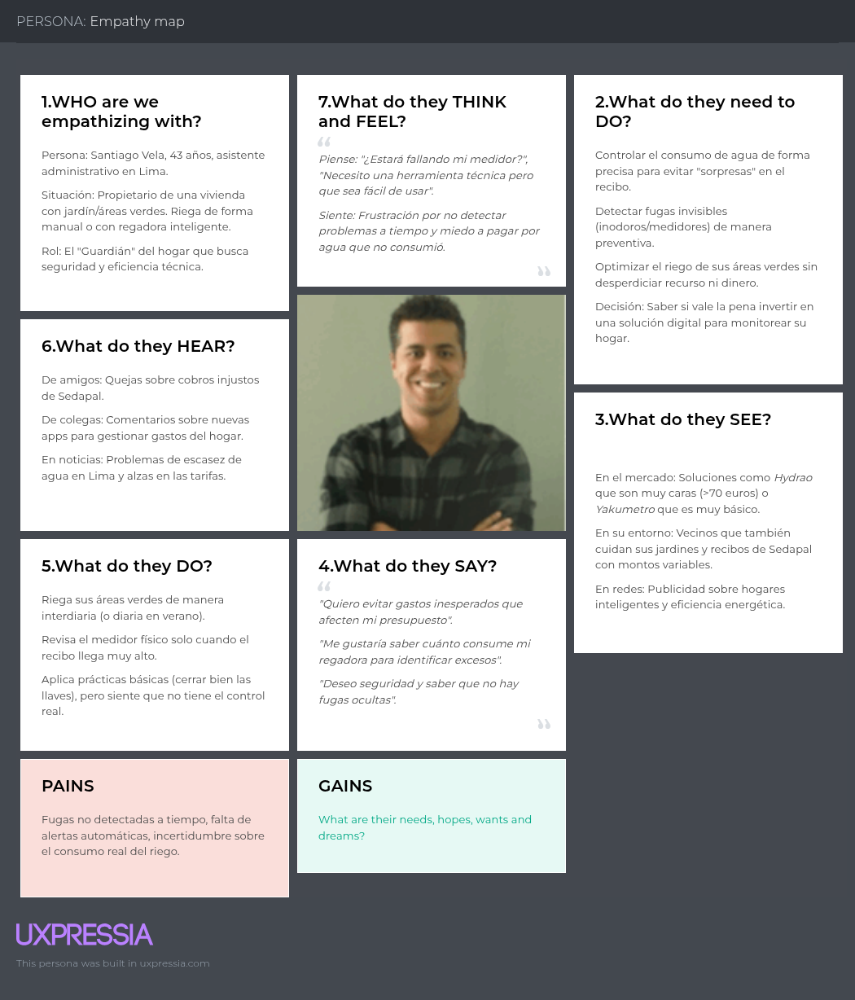
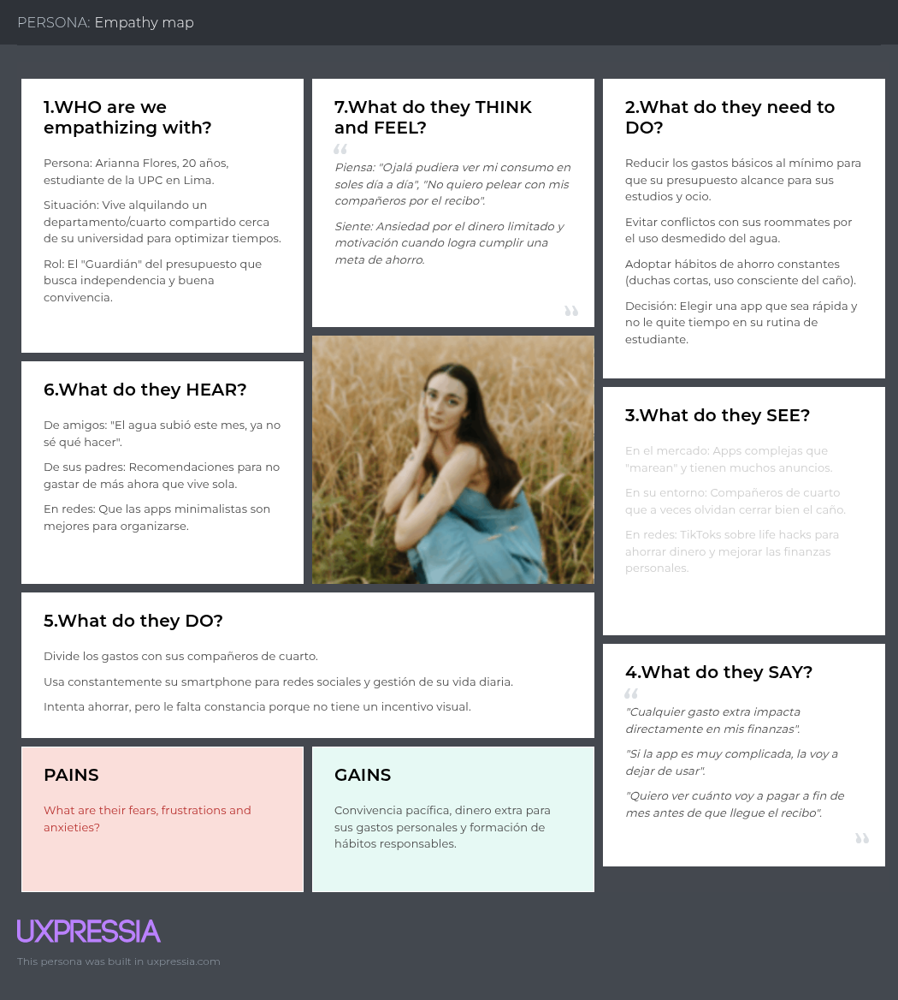

# Capítulo II: Requirements Elicitation & Analysis

## 2.1. Competidores

### 1. Hydrao

Hydrao es una startup de origen francés que fabrica duchas inteligentes donde, mediante LED que cambian de color, indican el consumo de agua en litros en tiempo real. La aplicación móvil, que es gratuita, ofrece al usuario acceso a su historial de uso, visualización del progreso de ahorro de agua en sus hogares y establecer logros. Su uso de sistemas IoT la convierte en una referencia importante dentro del mercado de la optimización del agua en hogares.

Su modelo de negocio incluye una aplicación gratuita; sin embargo, esta funciona únicamente con su producto, el cual tiene un costo superior a los 70 euros.

### 2. Dropcountr

Dropcountr es una aplicación móvil y web estadounidense que ayuda a los usuarios a monitorear, gestionar y reducir su consumo de agua. A su vez, tiene integrado un sistema IoT por el cual interpreta datos de contadores inteligentes, lo que permite comparar el consumo con otros hogares, recibir alertas de posibles áreas en las que estén desperdiciando agua y establecer presupuestos a completar. Un factor diferenciador de Dropcountr es su conexión con proveedores de agua, que permite que sus usuarios puedan ver sus recibos, así como mantener una comunicación con los mismos.

En cuanto a costos, es una aplicación totalmente gratuita para los usuarios; sin embargo, solo está disponible para los usuarios de proveedores asociados con Dropcountr.

### 3. Yakumetro

Yakumetro es una iniciativa peruana hecha por Sunass. Esta es una plataforma web que funciona como simulador tarifario para calcular el consumo de agua y alcantarillado. Esta iniciativa destaca por la variedad de prestadores de servicio con los que se puede simular, así como el detalle del consumo, incluyendo el consumo promedio del lugar de residencia. Asimismo, resalta información importante como fugas y su equivalente en costo, y también consejos y demás.

Al ser una iniciativa de un organismo público, es totalmente gratuita.

### 2.1.1. Análisis Competitivo

<table>
  <tr>
    <th colspan="6">Competitive Analysis Landscape</th>
  </tr>
  <tr>
    <td colspan="2"><b>¿Por qué llevar a cabo este análisis?</b></td>
    <td colspan="4">El objetivo de este análisis es conocer mejor a los competidores que existen en el mercado de gestión inteligente del agua, entender qué están haciendo bien y mal, y así identificar en qué puntos HydroSmart puede diferenciarse. Esto es especialmente importante considerando que en Latinoamérica casi no hay soluciones digitales de este tipo consolidadas, lo que representa una gran oportunidad para la startup.</td>
  </tr>
  <tr>
    <td colspan="2"></td>
    <td><b>Su startup</b></td>
    <td><b>Competidor 1</b></td>
    <td><b>Competidor 2</b></td>
    <td><b>Competidor 3</b></td>
  </tr>
  <tr>
    <td colspan="2"></td>
    <td><b>HydroSmart</b> Perú / Latinoamérica</td>
    <td>
      <b>Hydrao</b>
      
       Francia
    </td>
    <td>
      <b>Dropcountr</b>
      
       EE.UU.
    </td>
    <td>
      <b>Yakumetro</b>
      
       Perú (SUNASS)
    </td>
  </tr>

  <!-- PERFIL -->
  <tr>
    <td rowspan="2"><b>Perfil</b></td>
    <td><b>Overview</b></td>
    <td>Startup peruana en etapa inicial que ofrece una plataforma digital (app móvil y web) para monitorear el consumo de agua en hogares. No necesita hardware físico, lo que la hace más accesible. Está pensada para propietarios, arrendadores y estudiantes que quieren controlar su gasto de agua sin complicaciones técnicas, con enfoque en Latinoamérica.</td>
    <td>Startup francesa que fabrica duchas inteligentes con LEDs que cambian de color para indicar en tiempo real cuántos litros de agua se consumen. Tiene una app móvil gratuita que complementa el producto físico con historial de uso, seguimiento del progreso de ahorro y logros desbloqueables.</td>
    <td>Aplicación móvil y web estadounidense que ayuda a los usuarios a monitorear y reducir su consumo de agua interpretando datos de contadores inteligentes. Permite comparar el consumo con otros hogares, recibir alertas de posibles fugas y gestionar presupuestos de consumo.</td>
    <td>Iniciativa peruana desarrollada por SUNASS que funciona como simulador tarifario web para calcular el consumo de agua y alcantarillado. Incluye información sobre fugas y su equivalente económico, consumo promedio del lugar de residencia y consejos de ahorro.</td>
  </tr>
  <tr>
    <td><b>Ventaja competitiva ¿Qué valor ofrece a los clientes?</b></td>
    <td>No requiere hardware, eliminando la barrera económica de entrada. Modelo freemium adaptado al contexto latinoamericano con metas de ahorro según el presupuesto del usuario. Módulo exclusivo para arrendadores con departamentos de agua incluida en el alquiler. Combina ahorro económico con conciencia ambiental de forma accesible.</td>
    <td>Retroalimentación visual e intuitiva en tiempo real mediante LEDs, sin necesidad de abrir ninguna app. Cualquier miembro del hogar puede entender su consumo en el momento. Es una forma gamificada y física de promover el ahorro hídrico en el punto exacto donde ocurre el desperdicio.</td>
    <td>Integración con proveedores de agua que permite ofrecer datos reales y detallados del consumo sin hardware adicional. El usuario tiene historial, alertas, presupuestos y comunicación con su empresa de agua en un solo lugar. Muy útil donde ya existen contadores inteligentes instalados.</td>
    <td>Accesibilidad y confianza institucional al estar respaldada por SUNASS. Permite simular tarifas con varios prestadores del Perú y muestra información relevante sobre fugas y consumo promedio local. Es una herramienta educativa útil para el ciudadano promedio.</td>
  </tr>

  <!-- PERFIL DE MARKETING -->
  <tr>
    <td rowspan="2"><b>Perfil de Marketing</b></td>
    <td><b>Mercado objetivo</b></td>
    <td>Usuarios residenciales urbanos en Latinoamérica, foco inicial en Perú. Tres perfiles principales: propietarios con jardines, arrendadores de departamentos con agua incluida en el alquiler, y estudiantes o jóvenes inquilinos con presupuesto ajustado. Segmentos B y C con acceso a smartphone. Secundariamente, municipalidades e instituciones.</td>
    <td>Hogares europeos conscientes del medio ambiente, dispuestos a invertir en tecnología para reducir su consumo. Perfil adulto con interés en sostenibilidad y capacidad adquisitiva suficiente para adquirir el producto físico (más de 70 euros). También apunta a hoteles y establecimientos que quieran mejorar su imagen ecológica.</td>
    <td>Usuarios residenciales en zonas de EE.UU. donde los proveedores de agua ya cuentan con contadores inteligentes y tienen alianza con la plataforma. El alcance está limitado geográficamente a las ciudades donde operan sus proveedores asociados. Perfil de usuario bastante amplio en cuanto a edad.</td>
    <td>Todos los ciudadanos del Perú que quieran simular su consumo y tarifa de agua. No tiene un perfil de usuario muy específico; está pensada para cualquier persona que quiera entender mejor su recibo o calcular cuánto podría gastar.</td>
  </tr>
  <tr>
    <td><b>Estrategias de marketing</b></td>
    <td>Marketing digital en redes sociales (Instagram, TikTok, YouTube) con contenido educativo sobre ahorro hídrico. Modelo freemium como palanca de crecimiento orgánico. Alianzas con administradores de edificios, inmobiliarias y Sedapal. Campañas con datos locales impactantes sobre el costo de una fuga en Lima. Programa de referidos entre arrendadores.</td>
    <td>Marketing apoyado en la propuesta visual y ecológica del producto. Usa canales digitales, ferias de tecnología y sostenibilidad, y tiendas especializadas en productos eco-friendly. El producto mismo funciona como su mejor argumento de venta por su impacto visual en redes sociales.</td>
    <td>Modelo B2B2C: los proveedores de agua ofrecen la plataforma a sus usuarios como servicio adicional, lo que permite llegar a grandes volúmenes sin invertir tanto en marketing directo. Complementado con marketing de contenido sobre sostenibilidad y ahorro económico.</td>
    <td>Al ser una iniciativa pública, no tiene estrategia de marketing comercial. Su difusión se da a través de los canales institucionales de SUNASS, notas de prensa y campañas de educación ambiental del Estado peruano.</td>
  </tr>

  <!-- PERFIL DE PRODUCTO -->
  <tr>
    <td rowspan="3"><b>Perfil de Producto</b></td>
    <td><b>Productos & Servicios</b></td>
    <td>App móvil (iOS y Android) con seis módulos: monitoreo en tiempo real, alertas ante consumo anómalo o fugas, metas de ahorro personalizadas, historial de consumo por períodos, panel de control para arrendadores con varias unidades, y recomendaciones de ahorro. Plataforma web complementaria.</td>
    <td>Ducha inteligente con LEDs que cambian de color según los litros consumidos (verde, azul, naranja, rojo). Se complementa con una app móvil gratuita que muestra historial de uso, progreso de ahorro y logros desbloqueables. La app solo funciona si se tiene el hardware físico.</td>
    <td>Plataforma web y app móvil gratuita que interpreta datos de contadores inteligentes. Ofrece comparativas de consumo con hogares similares, alertas de posible desperdicio, gestión de presupuestos y comunicación directa con el proveedor de agua. No requiere hardware adicional.</td>
    <td>Plataforma web gratuita que funciona como simulador tarifario. El usuario selecciona su prestador de servicio y simula su consumo de agua y alcantarillado. Incluye información sobre fugas, consumo promedio de la zona y consejos básicos de ahorro. Sin app móvil ni funciones en tiempo real.</td>
  </tr>
  <tr>
    <td><b>Precios & Costos</b></td>
    <td>Modelo freemium sin costo de hardware. Plan gratuito con funciones básicas. Plan Premium individual (~S/. 15–25/mes) con alertas avanzadas y análisis detallado. Plan Arrendador (~S/. 40–60/mes) para gestionar múltiples unidades. Costo de entrada prácticamente cero.</td>
    <td>App gratuita, pero depende del hardware. El producto físico (ducha inteligente) supera los 70 euros, lo que representa una barrera de entrada considerable. No tiene modelo de suscripción mensual.</td>
    <td>Totalmente gratuita para el usuario final. Los costos son asumidos por los proveedores de agua que contratan la plataforma. Para el usuario no hay ningún costo directo, lo que facilita mucho su adopción.</td>
    <td>Completamente gratuita al ser una herramienta pública de SUNASS. No tiene ningún costo asociado para el usuario ni modelo de monetización.</td>
  </tr>
  <tr>
    <td><b>Canales de distribución (Web y/o Móvil)</b></td>
    <td>Plataforma 100% digital. App disponible en App Store y Google Play. Web para gestión de arrendadores. Sin hardware ni visita técnica necesaria. Distribución directa sin intermediarios.</td>
    <td>App móvil gratuita en App Store y Google Play, condicionada a la compra del hardware. El producto físico se vende en tienda oficial online y tiendas especializadas en tecnología y productos ecológicos en Europa.</td>
    <td>App móvil (iOS y Android) y plataforma web. La distribución depende completamente de los acuerdos con proveedores de agua. No hay venta directa ni distribución en retail.</td>
    <td>Solo disponible como plataforma web, sin app móvil. Accesible desde cualquier navegador sin registro ni descarga. Distribuida únicamente a través de los canales oficiales de SUNASS.</td>
  </tr>

  <!-- ANÁLISIS SWOT -->
  <tr>
    <td rowspan="4"><b>Análisis SWOT</b></td>
    <td><b>Fortalezas</b></td>
    <td>No requiere hardware, costo de entrada casi cero. Modelo freemium que facilita la adopción masiva. Única solución pensada para el mercado latinoamericano con módulos para arrendadores y estudiantes. Bajo costo operativo sin inventario físico. Capacidad de adaptarse rápido al feedback de sus usuarios.</td>
    <td>Retroalimentación visual en tiempo real sin necesidad de abrir ninguna app. Enfoque claro y fácil de comunicar. Solución concreta en el punto donde ocurre el mayor desperdicio. Presencia consolidada en el mercado europeo en el segmento eco-friendly.</td>
    <td>Completamente gratuita para el usuario final. Integración con proveedores de agua que da acceso a datos reales sin hardware adicional. Función de comunicación directa con el proveedor, un diferenciador único. Modelo B2B2C escalable y sostenible.</td>
    <td>Respaldada por SUNASS, lo que le da credibilidad institucional inmediata. Totalmente gratuita y de fácil acceso desde cualquier navegador. Cubre múltiples prestadores del Perú con información local detallada sobre tarifas y consumo promedio.</td>
  </tr>
  <tr>
    <td><b>Debilidades</b></td>
    <td>Startup nueva sin historial comprobado. Depende de medidores analógicos existentes, lo que puede limitar la precisión del monitoreo. Recursos financieros y de equipo limitados. Sin alianzas aseguradas con Sedapal. Cultura de pago por apps de servicios básicos aún incipiente en Perú.</td>
    <td>La app no funciona sin el hardware, elevando el costo total de la solución. Solo monitorea la ducha, no toda la instalación del hogar. Presencia concentrada en Europa con poca penetración en otros mercados.</td>
    <td>Dependencia total de los proveedores de agua asociados: si el proveedor local no tiene alianza con Dropcountr, el usuario no puede usarla. Escalabilidad geográfica muy limitada. Sin funciones de recomendaciones personalizadas más allá de alertas básicas.</td>
    <td>Es un simulador estático, sin monitoreo en tiempo real ni alertas. Sin app móvil ni funciones interactivas avanzadas. Su evolución tecnológica es lenta al depender de SUNASS. No está diseñada para gestión activa del consumo, solo para consulta y simulación.</td>
  </tr>
  <tr>
    <td><b>Oportunidades</b></td>
    <td>Mercado latinoamericano de gestión hídrica digital prácticamente vacío de competidores. Creciente conciencia ambiental en jóvenes urbanos. ODS 6 de la ONU presiona por eficiencia hídrica. Posibles alianzas con Sedapal y municipalidades. Expansión del acceso a smartphones en la región e interés creciente de inversionistas de impacto.</td>
    <td>Expansión a mercados fuera de Europa donde crece la conciencia ambiental, como Latinoamérica o Asia-Pacífico. Posibilidad de desarrollar más módulos de monitoreo más allá de la ducha. Regulación medioambiental europea cada vez más exigente.</td>
    <td>A medida que más proveedores implementen contadores inteligentes, su mercado potencial crece. Posible expansión a Latinoamérica con alianzas locales como Sedapal. Podría agregar funciones de recomendación personalizada para aumentar el valor percibido.</td>
    <td>Podría evolucionar hacia una plataforma más completa con funciones en tiempo real si recibe más financiamiento o establece alianzas tecnológicas. Su base institucional le da ventaja para convertirse en el estándar digital de gestión hídrica en Perú.</td>
  </tr>
  <tr>
    <td><b>Amenazas</b></td>
    <td>Competidores con más recursos podrían entrar al mercado latinoamericano. Baja cultura de pago recurrente por apps en Perú. Infraestructura deficiente de medidores en zonas periféricas. Yakumetro, al ser gratuita y pública, podría restar usuarios que buscan solo información básica. Riesgo de baja retención si los usuarios no adoptan el hábito de uso regular.</td>
    <td>El alto costo del hardware puede frenar su adopción frente a soluciones digitales gratuitas. Competidores puramente digitales como HydroSmart o Dropcountr representan una alternativa más accesible para el grueso del mercado.</td>
    <td>Si los proveedores de agua desarrollan sus propias apps de monitoreo, Dropcountr podría perder su posición. Cambios en las políticas de datos de los proveedores asociados podrían afectar su acceso a la información. En mercados sin contadores inteligentes, simplemente no puede operar.</td>
    <td>Al depender de un organismo público, está sujeta a cambios presupuestarios o de gestión que podrían dejarla desactualizada. Startups privadas con más recursos tecnológicos podrían ofrecer herramientas más completas que la hagan obsoleta rápidamente.</td>
  </tr>
</table>

## 2.1.2. Estrategias y tácticas frente a competidores.

HydroSmart cuenta con una ventaja clara frente a sus competidores más cercanos: es la única solución completamente digital, sin hardware, diseñada específicamente para el contexto latinoamericano. Frente a Hydrao, que requiere invertir más de 70 euros solo en el producto físico, HydroSmart elimina esa barrera por completo con su modelo freemium, lo que lo hace mucho más accesible para los segmentos B y C del mercado peruano.

Frente a Dropcountr, la táctica debe ser anticiparse: desarrollar alianzas tempranas con Sedapal y otros proveedores de agua del Perú antes de que un competidor externo lo haga. Si HydroSmart logra integrarse con los datos de consumo de Sedapal, replicaría la propuesta más fuerte de Dropcountr pero con el contexto local que ninguna app extranjera puede ofrecer de forma natural.

Respecto a Yakumetro, que es gratuita y tiene respaldo institucional, la estrategia no es competir directamente sino diferenciarse en profundidad: Yakumetro es un simulador estático, mientras que HydroSmart ofrece gestión activa, alertas en tiempo real y metas personalizadas. La táctica es comunicar claramente esa diferencia y posicionarse como el siguiente paso natural para un usuario que ya conoce Yakumetro pero quiere algo más completo.

La táctica central de HydroSmart debe ser crecer mediante comunidad y contenido educativo, convirtiendo a los usuarios satisfechos en embajadores de la app, mientras construye las alianzas institucionales que le den acceso a datos reales de consumo y le otorguen credibilidad frente a un mercado que aún no conoce este tipo de soluciones.

## 2.2. Entrevistas

Con el objetivo de conocer cómo los usuarios gestionan actualmente su consumo de agua y qué dificultades enfrentan, se llevaron a cabo entrevistas dirigidas a dos grupos principales: propietarios de viviendas con áreas verdes y estudiantes que alquilan. Para cada segmento se diseñaron preguntas abiertas que permitieran entender sus hábitos, nivel de control sobre el gasto y su interés en utilizar soluciones tecnológicas para optimizar el uso del agua.

La información recopilada fue revisada y organizada para identificar comportamientos recurrentes, problemas comunes y necesidades no cubiertas. Este análisis permitió obtener una visión más clara sobre cómo los usuarios toman decisiones respecto al consumo de agua y qué factores influyen en su disposición a adoptar nuevas herramientas.

A partir de estos hallazgos, se pudieron establecer criterios clave para el desarrollo de AquaPulse, asegurando que la solución responda a situaciones reales, facilite el control del consumo y aporte valor tanto en el ahorro económico como en la gestión eficiente del recurso hídrico.

### 2.2.1. Diseño de entrevistas 
En esta sección se define la información a recolectar de los segmentos objetivo. Los datos básicos de los entrevistados serán registrados mediante un formulario, el cual estará disponible a través del siguiente enlace: https://docs.google.com/forms/d/e/1FAIpQLSeASAP7gDjpULkffOBbjQFhAo4xq-rRJhzjmd_Y2vJmM5wfVQ/viewform

**Entrevistas Segmento 1: Propietarios de viviendas con áreas verdes**
1. ¿Podría contarnos un poco sobre su ocupación y su tipo de vivienda actual?
2. ¿Cuenta con jardín o áreas verdes en su hogar? ¿Cómo gestiona actualmente el riego?
3. ¿Qué tan importante es para usted el control del consumo de agua en su hogar?
4. ¿Con qué frecuencia revisa su recibo de agua y qué decisiones toma a partir de él?
5. ¿Ha tenido problemas con fugas o consumos elevados de agua? ¿Cómo los detectó?
6. ¿Cuáles son las mayores frustraciones que tiene respecto al consumo de agua en su vivienda?
7. ¿Ha utilizado alguna herramienta o tecnología para monitorear su consumo de agua?
8. ¿Qué aspectos considera más importantes para optimizar el uso del agua en su hogar?
9. Si existiera una aplicación que le permita ver su consumo en tiempo real, ¿cómo cree que la usaría?
10. ¿Le resultaría útil recibir alertas cuando su consumo de agua sea inusualmente alto?
11. ¿Qué tipo de información le gustaría ver en una aplicación de este tipo?
12. ¿Qué lo motivaría a usar una herramienta para controlar su consumo de agua de manera constante?
13. ¿Qué preocupaciones tendría al usar una solución tecnológica para gestionar el agua en su hogar?
14. ¿Estaría dispuesto a pagar por una solución que le ayude a reducir su consumo de agua? ¿Por qué?

**Entrevistas Segmento 2: Estudiantes que alquilan**
1. ¿Podría compartirnos su edad, a qué se dedica y su situación actual de vivienda?
2. ¿Cómo maneja su presupuesto mensual, especialmente en servicios como agua?
3. ¿Qué tan consciente es de su consumo de agua en el día a día?
4. ¿Ha tenido alguna sorpresa con el recibo de agua? ¿Cómo reaccionó?
5. ¿Cuáles son sus principales frustraciones respecto al gasto de agua?
6. ¿Qué tan seguido piensa en ahorrar agua o reducir su consumo?
7. ¿Ha intentado cambiar sus hábitos para gastar menos agua? ¿Cómo?
8. Si pudiera ver su consumo de agua en tiempo real desde su celular, ¿cree que cambiaría algo en su rutina?
9. ¿Le ayudaría recibir alertas cuando esté gastando más agua de lo normal?
10. ¿Qué tipo de información le gustaría ver en una app de consumo de agua?
11. ¿Cómo debería ser una aplicación para que realmente la uses (simple, rápida, etc.)?
12. ¿Qué cosas te harían dejar de usar una app de este tipo?
13. ¿Qué tan dispuesto estarías a cambiar tus hábitos para ahorrar dinero en agua?
14. ¿Estarías dispuesto a pagar por una app que te ayude a controlar tu consumo y ahorrar dinero? ¿Por qué?

### 2.2.2. Registro de entrevistas

Url de las entrevistas: upc-pre-202610-1asi0730-2610-12263-HydroSmart https://shorturl.at/p85wb

**Entrevistas Segmento 1: Propietarios de viviendas con áreas verdes**

**Entrevista 1:**

Instante en el que inicia: 0 minutos y 2 segundos

- Nombres y Apellidos: Diego Andrey Paredes Rey de Castro
- Edad: 32 años
- Ubicación: Miraflores, Lima

Duración: 4 minutos y 42 segundos

**Resumen de Entrevista:**

El entrevistado, Diego, de 32 años, es propietario de una vivienda con áreas verdes, las cuales riega de manera interdiaria. Actualmente, no presenta mayores molestias en cuanto al consumo de agua ni a los costos del servicio, por lo que se siente conforme con su situación. Sin embargo, le gustaría tener un mejor control sobre el uso del agua en su hogar; por ejemplo, contar con notificaciones en tiempo real que le avisen si ocurre una fuga o si el consumo se eleva más de lo normal. 

También muestra interés en una aplicación que le permita ver cómo se está usando el agua en elementos específicos, como las llaves, para detectar posibles desperdicios. Además, le gustaría saber cuánto consume su regadora inteligente y poder monitorear su uso durante el riego, especialmente para identificar posibles excesos o desperdicios. 

En general, aunque no tiene una necesidad urgente, sí está abierto a soluciones tecnológicas que le ayuden a monitorear y optimizar su consumo de agua de forma preventiva.

**Entrevista 2:**

Instante en el que inicia: 4 minutos y 44 segundos

- Nombres y Apellidos: Yusnury Vivar 
- Edad: 30 años
- Ubicación: San Miguel, Lima

Duración: 4 minutos y 29 segundos

**Resumen de Entrevista:**

En esta entrevista, Yusnury nos comenta que sí ha enfrentado inconvenientes relacionados con el consumo de agua en su hogar, especialmente por fugas que no detectó a tiempo y que recién identificó al recibir un recibo mensual con un monto considerablemente mayor al habitual. En su vivienda cuenta con áreas verdes que riega todos los días, lo que también influye en su consumo general.

Si bien tiene conocimiento de prácticas básicas para ahorrar agua, como cerrar correctamente las llaves y caños, siente que esto no es suficiente para tener un control real sobre su consumo. Por ello, le gustaría contar con una forma más precisa de monitorear el uso del agua y evitar desperdicios innecesarios. En este sentido, se muestra bastante interesada y abierta a adoptar una solución tecnológica que le permita gestionar mejor su consumo, prevenir fugas y reducir gastos de manera más eficiente

**Entrevista 3:**

Instante en el que inicia: 9 minutos y 14 segundos

- Nombres y Apellidos: Paul Garcia Newman
- Edad: 46 años
- Ubicación: Jesus Maria, Lima

Duración: 8 minutos y 43 segundos

**Resumen de Entrevista:**

El entrevistado Paul de 46 años, se dedica al rubro textil y reside en una vivienda de 120 m² con un pequeño jardín frontal. Actualmente, realiza el riego de sus áreas verdes de forma tradicional mediante una manguera durante las noches. Aunque considera que su consumo actual es normal para las cuatro personas que habitan el hogar, ha tenido experiencias negativas en el pasado con fugas difíciles de detectar en inodoros y problemas con medidores defectuosos, lo que le generó gastos innecesarios durante meses.

Muestra un gran interés en una solución tecnológica que le brinde transparencia sobre su consumo en tiempo real. Específicamente, le gustaría que una aplicación le permitiera comparar el gasto diario con el recibo mensual y que incluya alertas inmediatas ante consumos inusualmente altos para prevenir fugas.

Además, destaca como una funcionalidad clave la capacidad de convertir los metros cúbicos consumidos directamente a soles, permitiéndole entender el impacto económico de su consumo día a día. En general, está dispuesto a invertir en una herramienta preventiva que le ayude a evitar cobros injustos y a optimizar el uso del agua por motivos de ahorro.

**Entrevistas Segmento 2: Estudiantes que alquilan**

**Entrevista 1:**

Instante en el que inicia: 18 minutos y 0 segundos

- Nombres y Apellidos: Camila Luciana Diaz Diaz
- Edad: 18 años
- Ubicación: San Borja, Lima

  [-img.png)](https://postimg.cc/VJQXKNrq)

Duración: 7 minutos y 43 segundos

**Resumen de Entrevista**

En esta entrevista, Camila nos comenta cómo se maneja el consumo de agua en su vivienda actual. Destaca que, aunque ella no es quien paga los recibos, sus hábitos y los de sus hermanas, con quienes vive, terminan afectando la economía familiar. Señala que, si bien en ocasiones piensa en el consumo de agua, no es algo recurrente; sin embargo, ha habido momentos en los que sus padres han llamado la atención sobre un consumo excesivo en actividades cotidianas.

Asimismo, menciona que, aunque no está constantemente enfocada en ahorrar, intenta aplicar hábitos comunes de ahorro, como reducir el tiempo de ducha, entre otros. También expresa que una de sus principales frustraciones respecto al consumo de agua es que, en ocasiones, este se produce sin que sean conscientes de dónde ocurre.

En cuanto a una posible aplicación, considera que sería útil siempre que sea rápida de usar, simple e intuitiva. Además, cree que debería incluir un área informativa con consejos que ayuden a fomentar el ahorro. Indica que, si contara con recordatorios constantes o incentivos, estaría más dispuesta a cambiar sus hábitos. Finalmente, menciona que estaría dispuesta a pagar por la aplicación después de un tiempo de uso, siempre que perciba que realmente vale la pena la inversión.

**Entrevista 2:**

Instante en el que inicia: 25 minutos y 40 segundos

- Nombres y Apellidos: Stephano Espinoza Cueva
- Edad: 21 años
- Ubicación: Jesus Maria, Lima

Duración: 9 minutos y 47 segundos

**Resumen de Entrevista:**

El entrevistado se llama Stephano, el cual es un estudiante de la Universidad Peruana de Ciencias Aplicadas, él, junto a un compañero, alquila una cuarto cercano a la ubicación de su centro de estudio, al ser un estudiante y vivir independientemente, es muy importante para él oprimizar sus gastos. Él considera que su consumo de agua es eficiente, sin embargo, ha notado en ciertas ocasiones que el recibo de agua puede generar sorpresas en el monto a cobrar, él lo atribuye a pequeños momentos en el día a día que pueden generar un problema grande a fin de mes, como el uso desmedido e inconsiente del agua en ciertos momentos.

Considera que una aplicación como la nuestra sería de suma utilidad para estudiantes como él que por el momento deben priorizar ahorrar en gastos básicos, opina que el hecho de saber su consumo diario o ver una estimación del monto a pagar a fin de mes son datos que le ayudarían bastante a conocer su uso del agua con el fin de ahorrar más dinero, además piensa que es innovador.

Él menciona que le interesaría usar nuestra aplicación siempre y cuando cuente con una interfaz minimalista y con datos organizados y fáciles de entender, además, considera útil realizar el pago de alguna suscripción o mensualidad dentro de la aplicación si realmente lo propuesto cumple con su función y le ayuda a ahorrar dinero en los reicbos de agua a fin de mes. En general, considera útil la solución propuesta por HydroSmart y muestra interés de uso completo y pago si es que logra ver un ahorro en sus recibos de agua a fin de mes.

**Entrevista 3:**

Instante en el que inicia: 35 minutos y 25 segundos

- Nombre y Apellidos: Rodrigo Valencia
- Edad: 22
- Ubicación: Carabayllo, Lima

Duración: 3 minutos y 46 segundos

**Resumen de Entrevista:**

El entrevistado se llama Rodrigo, un joven de 22 años que se desempeña como estudiante y profesional freelance de animación digital. Actualmente vive solo, por lo que el manejo de su presupuesto mensual es un factor clave en su organización personal. Rodrigo estima que el gasto de agua representa aproximadamente un 2% de sus ingresos (entre 20 y 30 soles), y aunque se considera una persona consciente que intenta ahorrar y utilizar solo lo necesario, ha experimentado "sorpresas" en sus recibos, llegando a pagar montos inusuales de hasta 40 soles.

Considera que la posibilidad de visualizar su consumo en tiempo real desde el celular cambiaría positivamente su rutina, ya que le permitiría tener una proyección clara de cuánto pagará a fin de mes. Rodrigo destaca que las alertas de consumo excesivo serían fundamentales para ayudarlo a autocontrolarse y evitar exceder sus límites diarios.

Para él, es indispensable que la aplicación cuente con una interfaz simple y directa, pues opina que una plataforma demasiado complicada resultaría confusa y terminaría por desincentivar su uso. Asimismo, señala que el exceso de anuncios sería un motivo para abandonar la herramienta. Finalmente, muestra una disposición favorable a pagar por la aplicación, viéndolo como una inversión que le permitirá optimizar sus gastos y evitar cobros excesivos en sus servicios básicos.

### 2.2.3. Análisis de entrevistas

| Segmento | Características                                                                                                                                                                                                                                  | Objetivos comunes | Características subjetivas comunes |
|----------|--------------------------------------------------------------------------------------------------------------------------------------------------------------------------------------------------------------------------------------------------|------------------|-----------------------------------|
| Segmento #1: Propietarios de viviendas con áreas verdes | Sexo: Mixto Edad: 30-60 años Dispositivos: Smartphone, laptop, dispositivos inteligentes Programas: Redes sociales profesional.  Canales de información: Plataformas digitales y apps Canales de uso: Gestión del hogar y consumo | Controlar el consumo de agua  Optimizar el riego de áreas verdes  Prevenir fugas y desperdicios  Reducir costos de servicios  Implementar tecnología en el hogar  Mejorar eficiencia de recursos | Motivación: Tener control del consumo y evitar gastos innecesarios.  Frustración: No detectar fugas a tiempo y falta de información clara. |
| Segmento #2: Estudiantes que alquilan | Sexo: Mixto Edad: 18-28 años Dispositivos: Smartphone, laptop Programas: Apps móviles y redes sociales Canales de información: Redes sociales y entorno digital Canales de uso: Organización de gastos y convivencia              | Reducir gastos del hogar  Tener control del consumo de agua  Evitar conflictos entre roommates  Adoptar hábitos de ahorro  Usar soluciones simples  Mantener comodidad | Motivación: Ahorrar dinero y mejorar la convivencia.  Frustración: No saber en qué se gasta el agua y falta de control. |

## 2.3. Needfinding

El proceso de needfinding se centró en comprender a profundidad las necesidades, hábitos y dificultades de dos segmentos clave: los propietarios de viviendas con áreas verdes, representados por Santiago Vela, y los estudiantes que alquilan, representados por Arianna Flores. A partir de entrevistas cualitativas, se lograron identificar tanto comportamientos compartidos como diferencias importantes entre ambos grupos, especialmente en la forma en que gestionan y perciben el consumo de agua dentro de sus hogares.

Por un lado, los propietarios buscan mayor control, monitoreo y prevención de problemas como fugas o consumos excesivos, mientras que los estudiantes priorizan soluciones simples que se adapten a su estilo de vida y les permitan reducir gastos sin complicaciones. En conjunto, los hallazgos evidencian una oportunidad clara para desarrollar herramientas tecnológicas que faciliten el seguimiento del consumo de agua, promuevan hábitos más eficientes y se ajusten a las distintas dinámicas de cada tipo de usuario. Este análisis permitió establecer una base sólida para diseñar una solución alineada con las verdaderas necesidades y expectativas de ambos segmentos.

### 2.3.1. User Personas

En esta etapa se construyeron perfiles ficticios, conocidos como User Personas, que sintetizan las características más relevantes de los usuarios a partir del análisis de las entrevistas realizadas. Esta herramienta permite convertir la información recolectada en representaciones claras y útiles, que orientan el proceso de diseño y apoyan la toma de decisiones sobre funcionalidades y experiencia de uso. Para el desarrollo del proyecto, se definieron dos perfiles principales: uno enfocado en propietarios de viviendas con áreas verdes y otro en estudiantes que alquilan.

Anexo Diagrama User Persona: https://goo.su/3jV074Q

**Segmento 1: Propietarios de viviendas con áreas verdes**

**Segmento 2: Estudiantes que alquilan**

### 2.3.2. User Task Matrix

El análisis de las entrevistas permitió organizar las principales actividades de los usuarios en una matriz comparativa que refleja cómo interactúan con el consumo de agua en su día a día. En esta se detallan las tareas más comunes de cada segmento, junto con qué tan seguido las realizan y la relevancia que tienen para ellos. Esta visión facilita entender diferencias y coincidencias entre los perfiles, y sirve como base para tomar decisiones más acertadas durante el diseño, enfocándose en lo que realmente aporta valor a la experiencia del usuario.

| No. | Task | Santiago Vela |  | Arianna Flores |  |
|-----|------|---------------|--------------|----------------|--------------|
|     |      | Frequency     | Importance   | Frequency      | Importance   |
| 1   | Revisar el consumo de agua en el recibo | Monthly | High | Monthly        | Medium |
| 2   | Controlar el uso de agua en actividades diarias | Weekly | High | Occasionally   | Medium |
| 3   | Detectar posibles fugas en el hogar | Weekly | High | Occasionally   | High |
| 4   | Gestionar el riego de áreas verdes | Frequent | High | Rarely         | Low |
| 5   | Identificar momentos de mayor consumo | Weekly | High | Occasionally   | Medium |
| 6   | Aplicar prácticas de ahorro de agua | Frequent | High | Occasionally   | Medium |
| 7   | Establecer objetivos de ahorro | Sometimes | High | Occasionally   | Medium |
| 8   | Comparar consumo entre meses | Sometimes | Medium | Frequent         | Medium |
| 9   | Supervisar el uso del agua en el hogar compartido | Frequent | High | Frequent       | High |
| 10  | Buscar herramientas o soluciones para optimizar consumo | Occasionally | High | Occasionally   | High |

### 2.3.3. User Journey Mapping

**User Journey Segmento 1: Propietarios de viviendas con áreas verdes:**

**User Journey Segmento 2: Estudiantes que alquilan:**

### 2.3.4. Empathy Mapping.

**Segmento 1: Propietarios de viviendas con áreas verdes**

**Segmento 2: Estudiantes que alquilan**

## 2.4. Big Picture EventStorming

Para el desarrollo del Big Picture EventStorming de HydroSmart, se utilizó una herramienta colaborativa que es Miro, la cual permitió organizar de manera visual los eventos, actores y flujos del sistema enfocado en la gestión inteligente del consumo de agua en entornos residenciales.

Para ello se definió una leyenda:

- **Domain Events:** Representa hechos del sistema ya ocurridos.
- **Hotspot:** Punto de duda o mejora dentro del flujo.
- **Definition:** Conceptos clave del dominio.
- **Actor:** Usuario o sistema que ejecuta acciones.
- **Command:** Acción que se desea ejecutar.
- **Policy:** Regla que conecta eventos con acciones.
- **External System:** Sistemas externos como proveedores de agua.

**Big Picture EventStorming 1:**

Para el desarrollo del primer EventStorming se identificaron los domain events relacionados con el registro y acceso del usuario a la plataforma, como la validación correcta de los datos, la creación del usuario y el inicio de sesión. Primero se reconocen los pasos que ejecuta el actor principal (propietario o inquilino), como registrarse en la aplicación, ingresar sus datos personales y autenticar sus credenciales para acceder al sistema. También se muestran las validaciones realizadas por HydroSmart. Finalmente, se plantean preguntas para mejorar el flujo, como qué datos mínimos solicitar al usuario y cómo validar correctamente la información. 

**Big Picture EventStorming 2:**

Para el desarrollo de este segundo EventStorming se identificaron los domain events relacionados con el monitoreo y visualización del consumo de agua, además de la generación de reportes y configuración de parámetros. Al igual que en el anterior se reconocen los pasos que ejecuta el actor principal para acceder al panel y a estos reportes. También se muestran las acciones de Hydrosmart como el procesamiento de información. Finalmente se plantean preguntas para mejorar el flujo, como qué métricas mostrar en pantalla.

**Big Picture EventStorming 3:**

Este tercer EventStorming se trató la detección de anomalías y generación de alertas. Se reconocieron los domain events relacionados junto con la presentación de sugerencias. Se reconocen los pasos que sigue el sistema, como analizar los patrones de consumo, comparar el comportamiento actual con umbrales definidos y la generación de notificaciones. Finalmente, se plantean hotspots acerca de cómo definir con precisión una falla o cada cuánto se realizan los análisis. 

**Big Picture EventStorming 4:**

Para el desarrollo del cuarto EventStorming se identificaron los eventos de dominio relacionados con el historial de consumo, la configuración de metas de ahorro y la generación de recomendaciones automáticas. Se reconocieron las acciones del usuario como actor principal como acceder a la sección, revisar el consumo y definir una meta. En cuanto a las acciones del sistema se consideró, el análisis de datos previos, el cálculo del progreso de ahorro y las sugerencias personalizadas. Finalmente, se plantean preguntas para mejorar el flujo, como cómo definir metas realistas y cómo mostrar el avance de forma clara.

**Conclusión**

El Big Picture EventStorming permitió establecer de manera clara el funcionamiento de HydroSmart, identificando los principales comportamientos, eventos, las reglas y los actores involucrados. 

Asimismo ayudó a detectar ciertos puntos que no están del todo claros que deberán ser resueltos en etapas posteriores del desarrollo, para asegurar que la solución esté alineada con las necesidades reales de los usuarios.

## 2.5. Ubiquitous Language

| Ubiquitous Term       | Definición del Dominio Funcional                                                                                                  |
|-----------------------|-----------------------------------------------------------------------------------------------------------------------------------|
| User                  | Persona que utiliza la plataforma HydroSmart para monitorear y gestionar su consumo de agua.                                      |
| Property Owner        | Propietario de una vivienda que usa HydroSmart para controlar el consumo de agua en su hogar.                                     |
| Tenant                | Inquilino que utiliza la plataforma para supervisar su consumo de agua.                                                           |
| Dashboard             | Interfaz principal de la plataforma donde el usuario puede visualizar su consumo, reportes, alertas, historial y recomendaciones. |
| Water Consumption     | Cantidad de agua utilizada por el usuario en una cantidad de tiempo determinado.                                                  |
| Consumption History   | Registro histórico del consumo de agua del usuario mostrado por periodos.                                                         |
| Saving Goal           | Meta de ahorro definida por el usuario para reducir su consumo de agua.                                                           |
| Saving Progress       | Avance del usuario respecto a la meta de ahorro establecida.                                                                      |
| Report                | Resumen del consumo de agua mostrado de forma detallada.                                                                          |
| Alert                 | Notificación emitida por el sistema cuando se detecta un consumo inusual, una posible fuga y otra situación relevante.            |
| Anomalous Consumption | Consumo de agua que esta fuera del patrón normal registrado.                                                                      |
| Recomendation         | Sugerencia genera automáticamente para ayudar al usuario a optimizar su consumo de agua.                                          |
| Parameter             | Valor configurable dentro del sistema para personalizar elementos.                                                                |
| Device                | Sensor asociado al monitoreo del consumo de agua.                                                                                 |
| Authentication        | Proceso de validación de credenciales para permitir el acceso del usuario a la aplicación.                                        |
| Notification          | Mensaje enviado al usuario para informarle sobre eventos importante detectados por el sistema.                                    |
